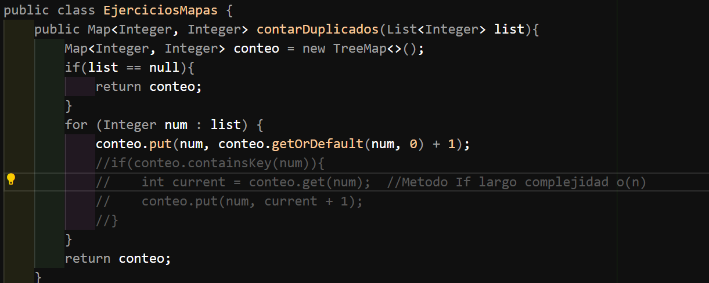
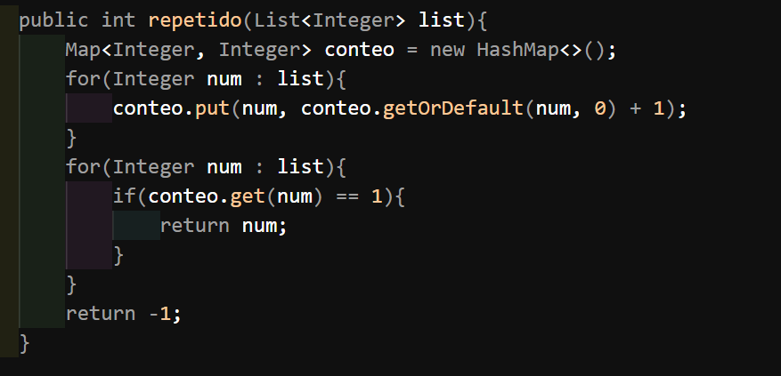
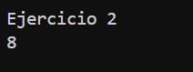
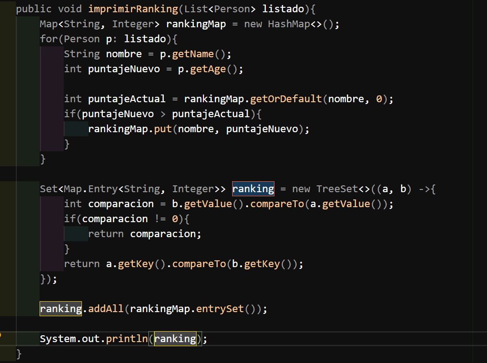
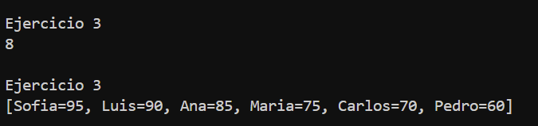
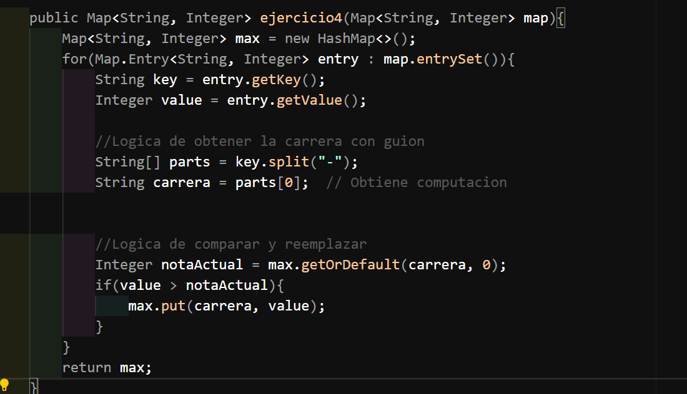
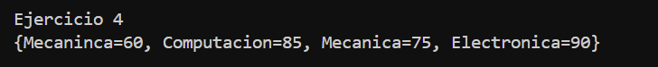

# Práctica: Estructuras No Lineales -

## Autor

- Nombre: Geovanny Cabrera
- Carrera/Curso: Estructura de Datos

## Nombre de la práctica - Fecha

- Práctica: Estructuras No Lineales
- Fecha: 2026-01-19

## Descripción

Descripción de que es lo que hizo o alcanzo desarrollar en la práctica.

## Evidencias

### Ejercicio 1

Inserta aquí la captura del código o de la ejecución.

- Archivo: 

Insertar la captura de la ejecución del código.

### Ejercicio 2

Inserta aquí la captura del código o de la ejecución.

- Archivo: 

Insertar la captura de la ejecución del código.

### Ejercicio 3

Inserta aquí la captura del código o de la ejecución.

- Archivo: 

Insertar la captura de la ejecución del código.

### Ejercicio 4
Inserta aquí la captura del código o de la ejecución.

- Archivo: 

Insertar la captura de la ejecución del código.

